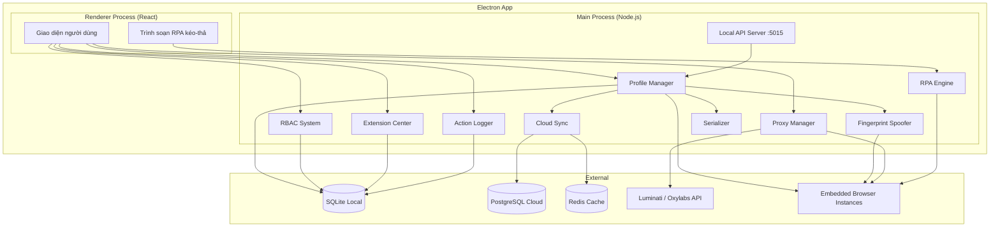
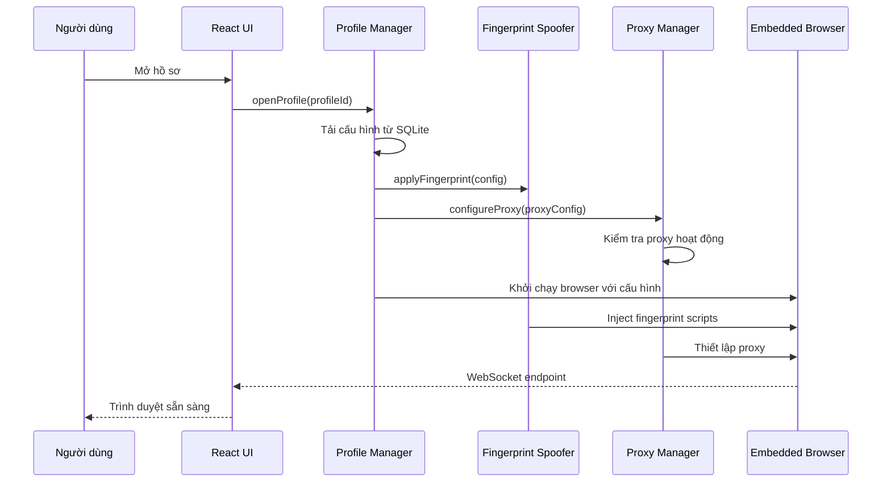
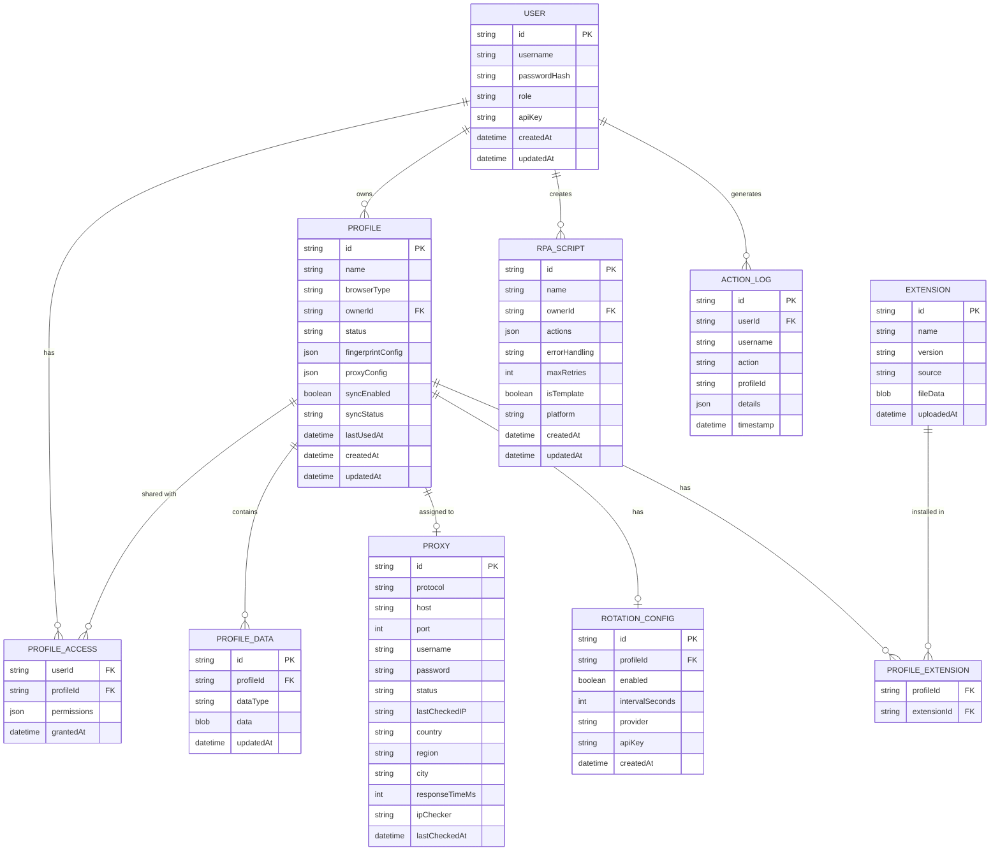

# Tài liệu Thiết kế — Hệ thống Quản lý Danh tính Số (Digital Identity Management)

## Tổng quan (Overview)

Hệ thống Quản lý Danh tính Số là một ứng dụng desktop xây dựng trên nền tảng Electron + React (frontend) và Node.js (backend), cho phép người dùng tạo và quản lý nhiều hồ sơ trình duyệt cô lập. Mỗi hồ sơ có fingerprint riêng biệt, proxy riêng và dữ liệu tách biệt hoàn toàn. Hệ thống hỗ trợ đồng bộ đám mây, tự động hóa RPA no-code, phân quyền RBAC và quản lý tiện ích mở rộng tập trung.

### Quyết định công nghệ chính

| Thành phần | Công nghệ | Lý do |
|---|---|---|
| Desktop App | Electron + React + TypeScript | Đa nền tảng, tích hợp tốt với Chromium, hệ sinh thái phong phú |
| Backend API | Node.js + Express | Cùng ngôn ngữ với frontend, hỗ trợ WebSocket tốt, phù hợp I/O-bound |
| Database (local) | SQLite (via better-sqlite3) | Nhẹ, không cần server, phù hợp ứng dụng desktop |
| Database (cloud) | PostgreSQL + Redis | PostgreSQL cho dữ liệu quan hệ, Redis cho cache và session |
| Browser Engine | Playwright (Chromium/Firefox) | Hỗ trợ cả Chromium và Firefox, API mạnh cho automation |
| RPA Engine | Custom drag-and-drop + Playwright | Kết hợp giao diện kéo-thả với Playwright để thực thi |
| Testing | Vitest + fast-check | Vitest cho unit test, fast-check cho property-based testing |

## Kiến trúc (Architecture)

### Kiến trúc tổng thể

Hệ thống sử dụng kiến trúc **multi-layer** với sự tách biệt rõ ràng giữa các tầng:



### Luồng dữ liệu chính



## Thành phần và Giao diện (Components and Interfaces)

### 1. Profile Manager (Trình quản lý hồ sơ)

Quản lý vòng đời đầy đủ của hồ sơ trình duyệt: tạo, sửa, xóa, mở, đóng.

```typescript
interface IProfileManager {
  createProfile(config: ProfileConfig): Promise<Profile>;
  openProfile(profileId: string): Promise<BrowserConnection>;
  closeProfile(profileId: string): Promise<void>;
  deleteProfile(profileId: string): Promise<void>;
  updateProfile(profileId: string, config: Partial<ProfileConfig>): Promise<Profile>;
  listProfiles(): Promise<ProfileSummary[]>;
}

interface ProfileConfig {
  name: string;
  browserType: 'chromium' | 'firefox';
  fingerprint: FingerprintConfig;
  proxy?: ProxyConfig;
  extensions?: string[]; // extension IDs
}

interface ProfileSummary {
  id: string;
  name: string;
  status: 'open' | 'closed';
  browserType: 'chromium' | 'firefox';
  proxyAssigned: string | null;
  lastUsedAt: string | null;
}

interface BrowserConnection {
  wsEndpoint: string;
  profileId: string;
}
```

### 2. Fingerprint Spoofer (Bộ giả lập fingerprint)

Tạo và áp dụng fingerprint giả lập cho mỗi hồ sơ.

```typescript
interface IFingerprintSpoofer {
  generateFingerprint(config: FingerprintConfig): FingerprintData;
  applyFingerprint(browser: BrowserContext, fingerprint: FingerprintData): Promise<void>;
  validateConsistency(fingerprint: FingerprintData): ValidationResult;
}

interface FingerprintConfig {
  canvas: { noiseLevel: number }; // 0.0 - 1.0
  webgl: { noiseLevel: number };
  audioContext: { frequencyOffset: number };
  cpu: { cores: number }; // 1-32
  ram: { sizeGB: number }; // 1-64
  userAgent: string;
  fonts: string[];
  webrtc: 'disable' | 'proxy' | 'real';
  platform: string;
  appVersion: string;
  oscpu: string;
}

interface FingerprintData {
  config: FingerprintConfig;
  canvasSeed: string;
  webglSeed: string;
  audioSeed: string;
}

interface ValidationResult {
  isValid: boolean;
  errors: string[];
}
```

### 3. Proxy Manager (Trình quản lý proxy)

Quản lý cấu hình, kiểm tra và xoay vòng proxy.

```typescript
interface IProxyManager {
  addProxy(config: ProxyConfig): Promise<Proxy>;
  removeProxy(proxyId: string): Promise<void>;
  assignToProfile(proxyId: string, profileId: string): Promise<void>;
  checkProxy(proxyId: string): Promise<ProxyCheckResult>;
  configureRotation(profileId: string, rotation: RotationConfig): Promise<void>;
  rotateIP(profileId: string): Promise<RotationResult>;
}

interface ProxyConfig {
  protocol: 'http' | 'https' | 'socks5';
  host: string;
  port: number;
  username?: string;
  password?: string;
}

interface ProxyCheckResult {
  status: 'passed' | 'failed';
  ip?: string;              // IP thực tế đi ra qua proxy
  country?: string;         // Quốc gia (e.g. "Vietnam")
  region?: string;          // Vùng (e.g. "Ho Chi Minh")
  city?: string;            // Thành phố (e.g. "Ho Chi Minh City")
  responseTimeMs: number;   // Thời gian phản hồi (ms)
  ipChecker: IPCheckerProvider; // Dịch vụ IP checker đã sử dụng
  checkedAt: string;
  error?: string;           // Thông báo lỗi nếu failed
}

type IPCheckerProvider = 'ip2location' | 'ipinfo' | 'ip-api';

interface IProxyChecker {
  checkProxy(proxyConfig: ProxyConfig, ipChecker?: IPCheckerProvider): Promise<ProxyCheckResult>;
}

interface RotationConfig {
  enabled: boolean;
  intervalSeconds: number;
  provider: 'luminati' | 'oxylabs';
  apiKey: string;
}

interface RotationResult {
  success: boolean;
  newIP?: string;
  attempts: number;
  error?: string;
}
```

### 4. Local API Server (API cục bộ)

HTTP server trên cổng 5015 cho tích hợp automation bên ngoài.

```typescript
interface ILocalAPIServer {
  start(port?: number): Promise<void>;
  stop(): Promise<void>;
}

// REST API Endpoints
// POST   /api/v1/profiles/:id/open    -> BrowserConnection
// POST   /api/v1/profiles/:id/close   -> void
// GET    /api/v1/profiles              -> ProfileSummary[]
// Header: X-API-Key: <api_key>
```

### 5. RPA Engine (Bộ RPA)

Thực thi kịch bản tự động hóa dạng kéo-thả.

```typescript
interface IRPAEngine {
  executeScript(profileId: string, script: RPAScript): Promise<RPAExecutionResult>;
  saveScript(script: RPAScript): Promise<string>;
  loadScript(scriptId: string): Promise<RPAScript>;
  listTemplates(platform?: string): Promise<RPATemplate[]>;
  loadTemplate(templateId: string): Promise<RPAScript>;
}

interface RPAScript {
  id?: string;
  name: string;
  actions: RPAAction[];
  errorHandling: 'stop' | 'skip' | 'retry';
  maxRetries?: number;
}

interface RPAAction {
  type: 'navigate' | 'click' | 'type' | 'wait' | 'scroll' | 'screenshot';
  selector?: string;
  value?: string;
  timeout?: number;
}

interface RPAExecutionResult {
  success: boolean;
  actionsCompleted: number;
  totalActions: number;
  errors: RPAError[];
}

interface RPAError {
  actionIndex: number;
  action: RPAAction;
  message: string;
  timestamp: string;
}

interface RPATemplate {
  id: string;
  name: string;
  platform: 'facebook' | 'amazon' | 'tiktok';
  description: string;
}
```

### 6. RBAC System (Hệ thống phân quyền)

Quản lý vai trò và quyền truy cập.

```typescript
interface IRBACSystem {
  createUser(user: CreateUserRequest): Promise<User>;
  updateRole(userId: string, role: Role): Promise<void>;
  checkAccess(userId: string, profileId: string, action: ProfileAction): AccessResult;
  shareProfile(profileId: string, targetUserId: string, permissions: Permission[]): Promise<void>;
  revokeAccess(profileId: string, targetUserId: string): Promise<void>;
}

type Role = 'admin' | 'manager' | 'user';
type ProfileAction = 'view' | 'open' | 'edit' | 'delete' | 'share';
type Permission = 'use' | 'edit' | 'delete' | 'share';

interface AccessResult {
  allowed: boolean;
  reason?: string;
}

interface User {
  id: string;
  username: string;
  role: Role;
  profileAccess: ProfileAccessEntry[];
}

interface ProfileAccessEntry {
  profileId: string;
  permissions: Permission[];
}
```

### 7. Cloud Sync (Bộ đồng bộ đám mây)

Đồng bộ dữ liệu hồ sơ giữa các máy tính.

```typescript
interface ICloudSync {
  syncProfile(profileId: string): Promise<SyncResult>;
  downloadProfile(profileId: string): Promise<Profile>;
  resolveConflict(profileId: string, resolution: 'local' | 'remote'): Promise<void>;
  getSyncStatus(profileId: string): Promise<SyncStatus>;
}

interface SyncResult {
  success: boolean;
  conflict?: boolean;
  bytesTransferred: number;
}

type SyncStatus = 'synced' | 'pending' | 'conflict' | 'error';
```

### 8. Extension Center (Trung tâm tiện ích)

Quản lý tập trung tiện ích mở rộng trình duyệt.

```typescript
interface IExtensionCenter {
  uploadExtension(file: Buffer, filename: string): Promise<Extension>;
  downloadFromStore(storeUrl: string): Promise<Extension>;
  assignToProfiles(extensionId: string, profileIds: string[]): Promise<void>;
  removeExtension(extensionId: string): Promise<void>;
  listExtensions(): Promise<Extension[]>;
}

interface Extension {
  id: string;
  name: string;
  version: string;
  source: 'upload' | 'store';
  assignedProfiles: string[];
}
```

### 9. Action Logger (Nhật ký hành động)

Ghi và truy vấn lịch sử hoạt động.

```typescript
interface IActionLogger {
  log(entry: ActionLogEntry): Promise<void>;
  query(filter: LogFilter): Promise<ActionLogEntry[]>;
}

interface ActionLogEntry {
  id: string;
  userId: string;
  username: string;
  action: string;
  profileId?: string;
  details: Record<string, unknown>;
  timestamp: string;
}

interface LogFilter {
  userId?: string;
  action?: string;
  startDate?: string;
  endDate?: string;
  limit?: number;
  offset?: number;
}
```

### 10. Profile Serializer (Bộ tuần tự hóa cấu hình)

Xuất/nhập cấu hình hồ sơ dưới dạng JSON.

```typescript
interface IProfileSerializer {
  serialize(profile: Profile): string; // JSON string
  deserialize(json: string): ProfileConfig;
  validate(json: string): ValidationResult;
}
```

## Mô hình Dữ liệu (Data Models)

### Sơ đồ quan hệ



### Bảng dữ liệu SQLite (Local)

**users** — Lưu thông tin người dùng và vai trò

| Cột | Kiểu | Mô tả |
|---|---|---|
| id | TEXT PK | UUID |
| username | TEXT UNIQUE | Tên đăng nhập |
| password_hash | TEXT | Mật khẩu đã hash (bcrypt) |
| role | TEXT | 'admin' \| 'manager' \| 'user' |
| api_key | TEXT UNIQUE | API key cho Local API |
| created_at | TEXT | ISO 8601 timestamp |
| updated_at | TEXT | ISO 8601 timestamp |

**profiles** — Lưu cấu hình hồ sơ trình duyệt

| Cột | Kiểu | Mô tả |
|---|---|---|
| id | TEXT PK | UUID |
| name | TEXT | Tên hồ sơ |
| browser_type | TEXT | 'chromium' \| 'firefox' |
| owner_id | TEXT FK | ID người tạo |
| status | TEXT | 'open' \| 'closed' |
| fingerprint_config | TEXT | JSON cấu hình fingerprint |
| proxy_id | TEXT FK | ID proxy được gán |
| sync_enabled | INTEGER | 0 \| 1 |
| sync_status | TEXT | 'synced' \| 'pending' \| 'conflict' \| 'error' |
| last_used_at | TEXT | ISO 8601 timestamp |
| created_at | TEXT | ISO 8601 timestamp |
| updated_at | TEXT | ISO 8601 timestamp |

**profile_data** — Lưu dữ liệu cô lập (Cookie, LocalStorage, etc.)

| Cột | Kiểu | Mô tả |
|---|---|---|
| id | TEXT PK | UUID |
| profile_id | TEXT FK | ID hồ sơ |
| data_type | TEXT | 'cookie' \| 'localstorage' \| 'indexeddb' \| 'cache' |
| data | BLOB | Dữ liệu nhị phân |
| updated_at | TEXT | ISO 8601 timestamp |

**action_logs** — Nhật ký hành động

| Cột | Kiểu | Mô tả |
|---|---|---|
| id | TEXT PK | UUID |
| user_id | TEXT FK | ID người dùng |
| username | TEXT | Tên người dùng (denormalized) |
| action | TEXT | Loại hành động |
| profile_id | TEXT | ID hồ sơ liên quan (nullable) |
| details | TEXT | JSON chi tiết |
| timestamp | TEXT | ISO 8601 timestamp |


## Thuộc tính Đúng đắn (Correctness Properties)

*Thuộc tính (property) là một đặc điểm hoặc hành vi phải luôn đúng trong mọi lần thực thi hợp lệ của hệ thống — về bản chất, đó là một phát biểu hình thức về những gì hệ thống phải thực hiện. Các thuộc tính đóng vai trò cầu nối giữa đặc tả dễ đọc cho con người và đảm bảo tính đúng đắn có thể kiểm chứng bằng máy.*

### Property 1: Tạo hồ sơ tạo vùng lưu trữ cô lập

*For any* cấu hình hồ sơ hợp lệ (ProfileConfig), khi tạo hồ sơ mới, hệ thống phải tạo ra một hồ sơ có vùng lưu trữ Cookie, LocalStorage, IndexedDB và Cache riêng biệt, và các vùng lưu trữ này không trùng với bất kỳ hồ sơ nào đã tồn tại.

**Validates: Requirements 1.1**

### Property 2: Xóa hồ sơ xóa toàn bộ dữ liệu liên quan

*For any* hồ sơ trình duyệt đã tồn tại, khi xóa hồ sơ đó, toàn bộ dữ liệu cô lập (Cookie, LocalStorage, IndexedDB, Cache) và cấu hình liên quan phải bị xóa hoàn toàn khỏi hệ thống.

**Validates: Requirements 1.4**

### Property 3: Cập nhật cấu hình hồ sơ là round-trip

*For any* hồ sơ và bất kỳ thay đổi cấu hình hợp lệ nào, sau khi lưu thay đổi và tải lại hồ sơ, cấu hình đọc được phải tương đương với cấu hình đã lưu.

**Validates: Requirements 1.5**

### Property 4: Danh sách hồ sơ chứa đầy đủ thông tin

*For any* tập hợp hồ sơ trong hệ thống, khi truy vấn danh sách hồ sơ (qua UI hoặc API), mỗi mục trong kết quả phải chứa tên, trạng thái (open/closed), proxy được gán và thời gian sử dụng gần nhất.

**Validates: Requirements 1.6, 7.4**

### Property 5: Phát hiện xung đột đồng bộ

*For any* hồ sơ được đồng bộ, khi hai máy tính cùng thực hiện chỉnh sửa khác nhau trên cùng hồ sơ, hệ thống phải phát hiện xung đột và không tự động ghi đè dữ liệu.

**Validates: Requirements 2.4**

### Property 6: Mã hóa dữ liệu trước khi đồng bộ

*For any* dữ liệu hồ sơ được đồng bộ lên cloud, payload truyền tải phải ở dạng mã hóa và không thể đọc được dưới dạng plaintext.

**Validates: Requirements 2.5**

### Property 7: Fingerprint phần cứng khác biệt giữa các hồ sơ

*For any* hai cấu hình fingerprint khác nhau, các giá trị hash Canvas, hash WebGL và tần số AudioContext được tạo ra phải khác biệt nhau.

**Validates: Requirements 3.1, 3.2, 3.3**

### Property 8: Giá trị phần cứng ảo trong phạm vi hợp lệ

*For any* cấu hình fingerprint, số lõi CPU phải nằm trong khoảng [1, 32] và dung lượng RAM phải nằm trong khoảng [1, 64] GB. Các giá trị ngoài phạm vi phải bị từ chối.

**Validates: Requirements 3.4, 3.5**

### Property 9: Fingerprint nhất quán trong phiên làm việc

*For any* hồ sơ trình duyệt đang hoạt động, việc đọc giá trị fingerprint phần cứng nhiều lần trong cùng phiên phải luôn trả về cùng một giá trị.

**Validates: Requirements 3.6**

### Property 10: Nhất quán User-Agent với navigator properties

*For any* cấu hình fingerprint, các thuộc tính User-Agent, platform, appVersion và oscpu phải nhất quán với nhau (ví dụ: UA chứa "Windows" thì platform phải là "Win32").

**Validates: Requirements 4.5**

### Property 11: Giới hạn font theo cấu hình hồ sơ

*For any* hồ sơ với danh sách font được cấu hình, tập hợp font mà trang web có thể phát hiện phải là tập con của danh sách font đã cấu hình.

**Validates: Requirements 4.2**

### Property 12: Lưu cấu hình proxy là round-trip

*For any* cấu hình proxy hợp lệ (ProxyConfig), sau khi lưu và tải lại, tất cả các trường (protocol, host, port, username, password) phải tương đương với bản gốc.

**Validates: Requirements 5.2**

### Property 12b: Kiểm tra proxy trả về thông tin geo-location đầy đủ

*For any* proxy đang hoạt động, khi kiểm tra qua IP checker service, kết quả phải chứa đầy đủ: trạng thái (passed), địa chỉ IP thực tế, quốc gia, vùng, thành phố và thời gian phản hồi. Khi proxy không hoạt động, kết quả phải có trạng thái (failed) kèm thông báo lỗi.

**Validates: Requirements 5.3, 5.4, 5.5**

### Property 13: Xoay vòng IP theo đúng khoảng thời gian

*For any* cấu hình xoay vòng IP với khoảng thời gian T giây, hệ thống phải kích hoạt xoay vòng tại thời điểm T ± sai số cho phép.

**Validates: Requirements 6.2**

### Property 14: API từ chối yêu cầu không hợp lệ với mã lỗi phù hợp

*For any* yêu cầu HTTP gửi đến Local API thiếu tham số bắt buộc hoặc có tham số sai kiểu, API phải trả về mã lỗi HTTP 4xx kèm thông báo mô tả lỗi cụ thể.

**Validates: Requirements 7.5**

### Property 15: Xác thực API key

*For any* yêu cầu gửi đến Local API, nếu API key không hợp lệ hoặc thiếu, hệ thống phải từ chối yêu cầu. Chỉ API key đúng mới được chấp nhận.

**Validates: Requirements 7.6**

### Property 16: RPA thực thi tuần tự đúng thứ tự

*For any* kịch bản RPA với danh sách hành động, các hành động phải được thực thi theo đúng thứ tự đã định nghĩa trong kịch bản.

**Validates: Requirements 8.3**

### Property 17: RPA xử lý lỗi theo cấu hình

*For any* kịch bản RPA có hành động thất bại, hệ thống phải thực hiện hành vi xử lý lỗi đúng theo cấu hình (stop: dừng ngay, skip: bỏ qua và tiếp tục, retry: thử lại tối đa số lần cấu hình).

**Validates: Requirements 8.4**

### Property 18: Lưu kịch bản RPA là round-trip

*For any* kịch bản RPA hợp lệ (RPAScript), sau khi lưu và tải lại, kịch bản phải tương đương với bản gốc bao gồm tên, danh sách hành động và cấu hình xử lý lỗi.

**Validates: Requirements 8.5**

### Property 19: Tải mẫu tạo RPAScript hợp lệ

*For any* mẫu tự động hóa (template) trong thư viện, khi tải mẫu, kết quả phải là một RPAScript hợp lệ với đầy đủ các trường bắt buộc.

**Validates: Requirements 9.2**

### Property 20: Tùy chỉnh mẫu không ghi đè mẫu gốc

*For any* mẫu tự động hóa, khi người dùng tùy chỉnh và lưu, mẫu gốc phải giữ nguyên không thay đổi.

**Validates: Requirements 9.3**

### Property 21: RBAC kiểm soát truy cập hồ sơ

*For any* người dùng với vai trò User và bất kỳ hồ sơ nào, nếu người dùng không được cấp quyền truy cập hồ sơ đó thì mọi thao tác (xem, mở, sửa, xóa) phải bị từ chối. Nếu chỉ có quyền 'use', thao tác sửa và xóa phải bị từ chối.

**Validates: Requirements 10.3, 10.5**

### Property 22: Thay đổi vai trò áp dụng quyền mới

*For any* thay đổi vai trò của thành viên, quyền truy cập mới phải được áp dụng ngay lập tức cho phiên làm việc tiếp theo.

**Validates: Requirements 10.4**

### Property 23: Chia sẻ hồ sơ không tiết lộ mật khẩu

*For any* hồ sơ có chứa mật khẩu tài khoản đã lưu, khi chia sẻ cho thành viên khác, thành viên nhận không thể truy cập hoặc xem mật khẩu đã lưu.

**Validates: Requirements 11.1**

### Property 24: Chia sẻ hồ sơ giữ nguyên fingerprint

*For any* hồ sơ được chia sẻ, cấu hình fingerprint của hồ sơ phải giữ nguyên hoàn toàn trước và sau khi chia sẻ.

**Validates: Requirements 11.2**

### Property 25: Nhật ký hành động chứa đầy đủ thông tin

*For any* hành động của người dùng trên hồ sơ (mở, đóng, sửa, xóa), bản ghi nhật ký phải chứa tên người dùng, loại hành động, hồ sơ liên quan và thời gian thực hiện.

**Validates: Requirements 12.1**

### Property 26: Lọc nhật ký trả về kết quả chính xác

*For any* bộ lọc nhật ký (theo người dùng, loại hành động, khoảng thời gian), tất cả kết quả trả về phải thỏa mãn điều kiện lọc, và không bỏ sót bản ghi nào thỏa mãn.

**Validates: Requirements 12.2**

### Property 27: User chỉ xem nhật ký của mình

*For any* người dùng có vai trò User, khi truy vấn nhật ký, kết quả chỉ chứa các bản ghi hành động của chính người dùng đó.

**Validates: Requirements 12.4**

### Property 28: Xác thực file tiện ích mở rộng

*For any* file được tải lên Extension Center, nếu file là .zip hợp lệ chứa manifest tiện ích thì phải được chấp nhận, ngược lại phải bị từ chối với thông báo lỗi cụ thể.

**Validates: Requirements 13.1, 13.6**

### Property 29: Gán tiện ích cài đặt cho tất cả hồ sơ trong nhóm

*For any* tiện ích và nhóm hồ sơ, khi gán tiện ích cho nhóm, tất cả hồ sơ trong nhóm phải có tiện ích đó trong danh sách đã cài đặt.

**Validates: Requirements 13.3**

### Property 30: Xóa tiện ích gỡ khỏi tất cả hồ sơ

*For any* tiện ích đã được gán cho các hồ sơ, khi xóa tiện ích khỏi kho tập trung, tiện ích phải bị gỡ khỏi tất cả hồ sơ đã được gán.

**Validates: Requirements 13.5**

### Property 31: Round-trip tuần tự hóa cấu hình hồ sơ

*For any* cấu hình hồ sơ hợp lệ, việc tuần tự hóa (serialize) thành JSON, sau đó phân tích (deserialize), rồi tuần tự hóa lại phải tạo ra kết quả JSON tương đương với bản tuần tự hóa ban đầu.

**Validates: Requirements 14.1, 14.2, 14.3**

### Property 32: Thông báo lỗi cụ thể cho JSON không hợp lệ

*For any* chuỗi JSON không hợp lệ hoặc thiếu trường bắt buộc, khi nhập vào hệ thống, thông báo lỗi phải mô tả cụ thể trường bị thiếu hoặc giá trị không hợp lệ.

**Validates: Requirements 14.4**

## Xử lý Lỗi (Error Handling)

### Chiến lược xử lý lỗi theo tầng

| Tầng | Loại lỗi | Xử lý |
|---|---|---|
| **UI (React)** | Lỗi render, lỗi form | Error boundary, hiển thị thông báo thân thiện, không crash app |
| **API (Express)** | Lỗi validation, lỗi auth | Trả HTTP status code phù hợp (400, 401, 403, 404, 500) kèm message |
| **Business Logic** | Lỗi nghiệp vụ | Throw custom error với error code và message cụ thể |
| **Database** | Lỗi query, constraint | Retry cho transient errors, rollback transaction, log chi tiết |
| **Browser** | Lỗi khởi chạy, crash | Retry 1 lần, thông báo người dùng, lưu trạng thái trước crash |
| **Network** | Timeout, mất kết nối | Retry với exponential backoff, queue cho sync, thông báo offline |

### Mã lỗi ứng dụng

```typescript
enum AppErrorCode {
  // Profile errors (1xxx)
  PROFILE_NOT_FOUND = 1001,
  PROFILE_ALREADY_OPEN = 1002,
  PROFILE_DATA_CORRUPTED = 1003,
  
  // Fingerprint errors (2xxx)
  INVALID_CPU_CORES = 2001,
  INVALID_RAM_SIZE = 2002,
  INCONSISTENT_FINGERPRINT = 2003,
  
  // Proxy errors (3xxx)
  PROXY_DEAD = 3001,
  PROXY_TIMEOUT = 3002,
  ROTATION_FAILED = 3003,
  PROVIDER_API_ERROR = 3004,
  
  // Auth errors (4xxx)
  INVALID_API_KEY = 4001,
  ACCESS_DENIED = 4002,
  ROLE_INSUFFICIENT = 4003,
  
  // Sync errors (5xxx)
  SYNC_CONFLICT = 5001,
  SYNC_NETWORK_ERROR = 5002,
  SYNC_ENCRYPTION_ERROR = 5003,
  
  // Extension errors (6xxx)
  INVALID_EXTENSION_FORMAT = 6001,
  EXTENSION_INSTALL_FAILED = 6002,
  
  // Serialization errors (7xxx)
  INVALID_JSON = 7001,
  MISSING_REQUIRED_FIELD = 7002,
  INVALID_FIELD_VALUE = 7003,
  
  // RPA errors (8xxx)
  RPA_ACTION_FAILED = 8001,
  RPA_SCRIPT_INVALID = 8002,
  RPA_TIMEOUT = 8003,
}
```

### Xử lý lỗi cụ thể

1. **Proxy không hoạt động khi khởi chạy hồ sơ (Req 5.5)**: Hiển thị dialog cho người dùng chọn proxy thay thế hoặc khởi chạy không proxy.
2. **Xoay vòng IP thất bại (Req 6.4)**: Retry tối đa 3 lần, sau đó thông báo lỗi và giữ IP hiện tại.
3. **Đồng bộ bị gián đoạn (Req 2.3)**: Lưu checkpoint, tự động resume khi có kết nối.
4. **File tiện ích không hợp lệ (Req 13.6)**: Từ chối file, trả thông báo lỗi mô tả nguyên nhân (sai định dạng, file hỏng, thiếu manifest).
5. **JSON cấu hình không hợp lệ (Req 14.4)**: Trả danh sách lỗi cụ thể cho từng trường bị thiếu hoặc giá trị sai.

## Chiến lược Kiểm thử (Testing Strategy)

### Công cụ kiểm thử

| Công cụ | Mục đích |
|---|---|
| **Vitest** | Unit test framework chính |
| **fast-check** | Property-based testing library |
| **Playwright Test** | Integration test cho browser automation |
| **MSW (Mock Service Worker)** | Mock HTTP requests cho cloud sync và proxy provider tests |

### Phương pháp kiểm thử kép (Dual Testing Approach)

#### Unit Tests (Vitest)
- Kiểm tra các ví dụ cụ thể, edge case và điều kiện lỗi
- Tập trung vào:
  - Ví dụ cụ thể cho từng loại trình duyệt (Chromium/Firefox)
  - Các giao thức proxy (HTTP/HTTPS/SOCKS5)
  - Các vai trò RBAC cụ thể
  - Edge case: chuỗi rỗng, giá trị biên, file hỏng
  - Xử lý lỗi: proxy chết, mất kết nối, file không hợp lệ

#### Property-Based Tests (fast-check)
- Kiểm tra các thuộc tính phổ quát trên mọi đầu vào
- Cấu hình: **tối thiểu 100 iterations** cho mỗi property test
- Mỗi test phải tham chiếu đến property trong tài liệu thiết kế
- Format tag: **Feature: digital-identity-management, Property {number}: {property_text}**
- Triển khai mỗi correctness property bằng **MỘT** property-based test duy nhất

#### Integration Tests (Playwright Test)
- Kiểm tra tích hợp giữa các thành phần
- Tập trung vào:
  - Khởi chạy browser với fingerprint và proxy (Req 1.2, 5.4)
  - Đồng bộ cloud (Req 2.1, 2.2, 2.3)
  - WebRTC proxy mode (Req 4.4)
  - Kiểm tra proxy qua mạng (Req 5.3)
  - Tích hợp Luminati/Oxylabs (Req 6.1, 6.3)
  - API mở/đóng hồ sơ (Req 7.2, 7.3)
  - Tải tiện ích từ Chrome Web Store (Req 13.2)
  - Tiện ích được cài khi khởi chạy (Req 13.4)

#### Smoke Tests
- Kiểm tra cấu hình và khởi động
  - HTTP server khởi chạy trên cổng 5015 (Req 7.1)
  - Chính sách lưu trữ nhật ký 90 ngày (Req 12.3)

### Ma trận kiểm thử theo yêu cầu

| Yêu cầu | Property Test | Unit Test | Integration Test | Smoke Test |
|---|---|---|---|---|
| 1.1 Tạo hồ sơ cô lập | P1 | | | |
| 1.2 Mở hồ sơ cô lập | | | ✓ | |
| 1.3 Chọn loại trình duyệt | | ✓ | | |
| 1.4 Xóa hồ sơ | P2 | | | |
| 1.5 Lưu cấu hình | P3 | | | |
| 1.6 Danh sách hồ sơ | P4 | | | |
| 2.1-2.3 Đồng bộ cloud | | | ✓ | |
| 2.4 Xung đột đồng bộ | P5 | | | |
| 2.5 Mã hóa dữ liệu | P6 | | | |
| 3.1-3.3 Fingerprint HW | P7 | | | |
| 3.4-3.5 CPU/RAM range | P8 | | | |
| 3.6 FP nhất quán | P9 | | | |
| 4.1 User-Agent | | ✓ | | |
| 4.2 Font list | P11 | | | |
| 4.3 WebRTC disable | | ✓ | | |
| 4.4 WebRTC proxy | | | ✓ | |
| 4.5 UA consistency | P10 | | | |
| 5.1 Giao thức proxy | | ✓ | | |
| 5.2 Lưu proxy config | P12 | | | |
| 5.3 Kiểm tra proxy geo | P12b | | ✓ | |
| 5.4 Browser dùng proxy | | | ✓ | |
| 5.5 Proxy chết | | ✓ | | |
| 6.1 Tích hợp provider | | | ✓ | |
| 6.2 Xoay vòng IP | P13 | | | |
| 6.3 Xác minh IP mới | | | ✓ | |
| 6.4 Retry 3 lần | | ✓ | | |
| 7.1 Server port 5015 | | | | ✓ |
| 7.2-7.3 API open/close | | | ✓ | |
| 7.4 API list profiles | P4 | | | |
| 7.5 API error codes | P14 | | | |
| 7.6 API key auth | P15 | | | |
| 8.1-8.2 RPA UI/blocks | | ✓ | | |
| 8.3 RPA tuần tự | P16 | | | |
| 8.4 RPA xử lý lỗi | P17 | | | |
| 8.5 Lưu RPA script | P18 | | | |
| 9.1 Thư viện mẫu | | ✓ | | |
| 9.2 Tải mẫu | P19 | | | |
| 9.3 Không ghi đè mẫu | P20 | | | |
| 10.1-10.2 RBAC roles | | ✓ | | |
| 10.3, 10.5 Access control | P21 | | | |
| 10.4 Role change | P22 | | | |
| 11.1 Chia sẻ không lộ PW | P23 | | | |
| 11.2 Chia sẻ giữ FP | P24 | | | |
| 11.3 Thu hồi quyền | | ✓ | | |
| 12.1 Ghi nhật ký | P25 | | | |
| 12.2 Lọc nhật ký | P26 | | | |
| 12.3 Lưu 90 ngày | | | | ✓ |
| 12.4 User xem log mình | P27 | | | |
| 13.1, 13.6 Validate ext | P28 | | | |
| 13.2 Chrome Web Store | | | ✓ | |
| 13.3 Gán ext nhóm | P29 | | | |
| 13.4 Ext khi khởi chạy | | | ✓ | |
| 13.5 Xóa ext tất cả | P30 | | | |
| 14.1-14.3 Round-trip | P31 | | | |
| 14.4 JSON lỗi | P32 | | | |
