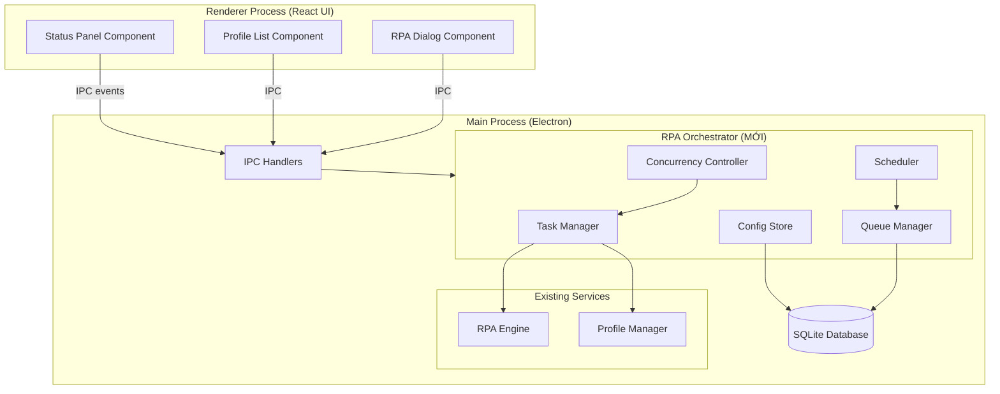
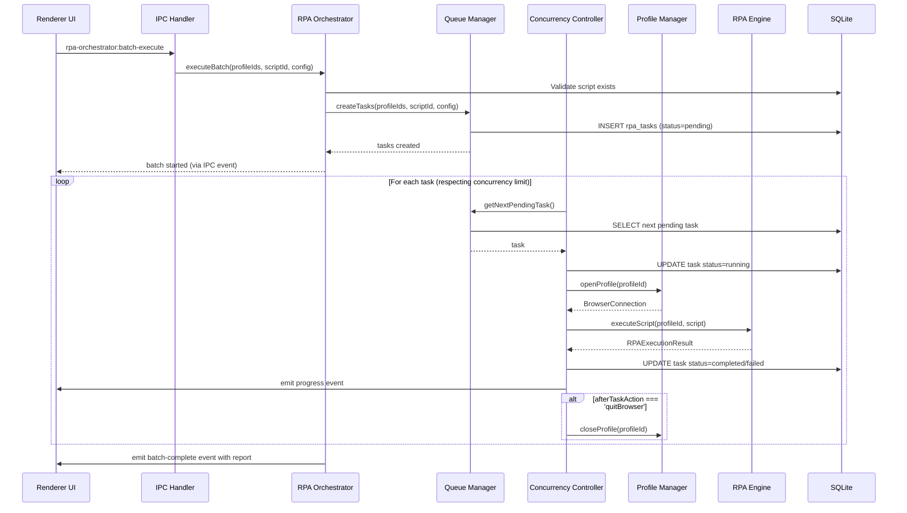
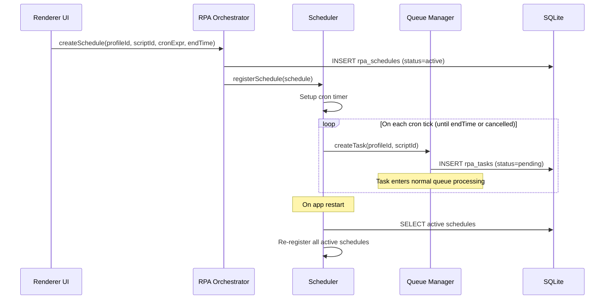

# Tài liệu Thiết kế — Tích hợp RPA tại cấp Profile (Profile-RPA)

## Tổng quan (Overview)

Tính năng Profile-RPA giới thiệu module **RPA Orchestrator** (`Bộ_điều_phối_RPA`) — lớp trung gian điều phối giữa RPA Engine và Profile Manager. Module này chịu trách nhiệm:

- Gán kịch bản RPA cho hồ sơ trình duyệt (đơn lẻ hoặc hàng loạt)
- Quản lý hàng đợi tác vụ (task queue) riêng biệt cho mỗi hồ sơ
- Kiểm soát đồng thời (concurrency control) với giới hạn tối đa
- Lập lịch thực thi theo biểu thức cron
- Theo dõi trạng thái thực thi theo thời gian thực
- Lưu trữ và khôi phục cấu hình RPA gần nhất cho mỗi hồ sơ

### Quyết định thiết kế chính

| Quyết định | Lý do |
|---|---|
| Tạo module mới `rpa-orchestrator` thay vì mở rộng `rpa-engine` | Tuân thủ Single Responsibility — RPA Engine chỉ thực thi script, Orchestrator điều phối lifecycle |
| Sử dụng SQLite cho task queue thay vì in-memory queue | Đảm bảo persistence qua restart, hỗ trợ recovery |
| Cron scheduling dùng `node-cron` library | Thư viện nhẹ, đã được kiểm chứng, hỗ trợ đầy đủ cron syntax |
| Event-driven architecture cho status updates | Cho phép UI cập nhật real-time qua IPC events |
| Concurrency control bằng semaphore pattern | Đơn giản, hiệu quả cho single-process Electron app |

## Kiến trúc (Architecture)

### Sơ đồ tổng quan hệ thống



### Luồng thực thi chính (Batch Execution Flow)



### Luồng lập lịch (Scheduling Flow)



## Thành phần và Giao diện (Components and Interfaces)

### 1. RPA Orchestrator (Entry Point)

File: `src/main/services/rpa-orchestrator/rpa-orchestrator.ts`

```typescript
import type Database from 'better-sqlite3';
import type { ProfileManager } from '../profile-manager/profile-manager';
import type { RPAEngine } from '../rpa-engine/rpa-engine';
import { EventEmitter } from 'events';

export interface BatchExecuteConfig {
  scriptId: string;
  profileIds: string[];
  executionOrder: 'ordered' | 'random';
  taskType: 'common' | 'scheduled';
  priority: boolean;
  scheduleConfig?: ScheduleConfig;
}

export interface ScheduleConfig {
  cronExpression: string;
  startTime?: string;       // ISO 8601
  endTime?: string;         // ISO 8601, optional
}

export interface BatchReport {
  batchId: string;
  totalProfiles: number;
  successCount: number;
  failureCount: number;
  errors: Array<{ profileId: string; error: string }>;
  startedAt: string;
  completedAt: string;
}

export interface TaskProgressEvent {
  taskId: string;
  profileId: string;
  status: TaskStatus;
  actionsCompleted: number;
  totalActions: number;
  currentAction?: string;
}

export type TaskStatus = 'pending' | 'running' | 'completed' | 'failed' | 'cancelled';

export class RPAOrchestrator extends EventEmitter {
  constructor(
    db: Database.Database,
    profileManager: ProfileManager,
    rpaEngine: RPAEngine,
    options?: { maxConcurrency?: number }
  );

  // Task Management
  createTask(profileId: string, scriptId: string, config: Partial<BatchExecuteConfig>): RPATask;
  createBatchTasks(config: BatchExecuteConfig): RPATask[];
  cancelTask(taskId: string): void;
  cancelAllForProfile(profileId: string): void;

  // Queue Operations
  getQueueForProfile(profileId: string): RPATask[];
  getRunningTasks(): RPATask[];
  getPendingTasks(): RPATask[];

  // Execution
  executeBatch(config: BatchExecuteConfig): Promise<BatchReport>;
  startQueueProcessing(): void;
  stopQueueProcessing(): void;

  // Scheduling
  createSchedule(profileId: string, scriptId: string, scheduleConfig: ScheduleConfig): RPASchedule;
  cancelSchedule(scheduleId: string): void;
  getActiveSchedules(): RPASchedule[];
  restoreSchedules(): void;

  // Configuration
  saveProfileConfig(profileId: string, config: ProfileRPAConfig): void;
  getProfileConfig(profileId: string): ProfileRPAConfig | null;
  setMaxConcurrency(max: number): void;

  // History
  getTaskHistory(profileId: string, limit?: number): RPATaskResult[];
}
```

### 2. Queue Manager

File: `src/main/services/rpa-orchestrator/queue-manager.ts`

```typescript
export class QueueManager {
  constructor(db: Database.Database);

  enqueue(task: RPATask): void;
  enqueuePriority(task: RPATask): void;
  dequeue(profileId: string): RPATask | null;
  dequeueNext(): RPATask | null;
  peek(profileId: string): RPATask | null;
  remove(taskId: string): void;
  getQueue(profileId: string): RPATask[];
  getAllPending(): RPATask[];
  updateStatus(taskId: string, status: TaskStatus): void;
  getRunningCount(): number;
}
```

### 3. Scheduler

File: `src/main/services/rpa-orchestrator/scheduler.ts`

```typescript
export class Scheduler {
  constructor(db: Database.Database, queueManager: QueueManager);

  register(schedule: RPASchedule): void;
  cancel(scheduleId: string): void;
  restore(): void;                    // Khôi phục schedules từ DB sau restart
  getActive(): RPASchedule[];
  getNextExecutionTime(cronExpression: string): Date;
  destroy(): void;                    // Cleanup all timers
}
```

### 4. Concurrency Controller

File: `src/main/services/rpa-orchestrator/concurrency-controller.ts`

```typescript
export class ConcurrencyController {
  constructor(maxConcurrency: number);

  acquire(): boolean;                 // Trả về true nếu có slot trống
  release(): void;                    // Giải phóng một slot
  getRunningCount(): number;
  getMaxConcurrency(): number;
  setMaxConcurrency(max: number): void;
  isFull(): boolean;
}
```

### 5. Config Store

File: `src/main/services/rpa-orchestrator/config-store.ts`

```typescript
export class ConfigStore {
  constructor(db: Database.Database);

  save(profileId: string, config: ProfileRPAConfig): void;
  load(profileId: string): ProfileRPAConfig | null;
  delete(profileId: string): void;
  validateScriptExists(scriptId: string): boolean;
}
```

### 6. IPC Handlers (Mở rộng)

Thêm vào `src/main/ipc-handlers.ts`:

```typescript
// ─── RPA Orchestrator handlers ───
ipcMain.handle('rpa-orchestrator:create-task', async (_event, profileId, scriptId, config) => { ... });
ipcMain.handle('rpa-orchestrator:batch-execute', async (_event, config) => { ... });
ipcMain.handle('rpa-orchestrator:cancel-task', async (_event, taskId) => { ... });
ipcMain.handle('rpa-orchestrator:cancel-all', async (_event, profileId) => { ... });
ipcMain.handle('rpa-orchestrator:get-queue', async (_event, profileId) => { ... });
ipcMain.handle('rpa-orchestrator:get-history', async (_event, profileId, limit) => { ... });
ipcMain.handle('rpa-orchestrator:create-schedule', async (_event, profileId, scriptId, scheduleConfig) => { ... });
ipcMain.handle('rpa-orchestrator:cancel-schedule', async (_event, scheduleId) => { ... });
ipcMain.handle('rpa-orchestrator:get-schedules', async () => { ... });
ipcMain.handle('rpa-orchestrator:save-config', async (_event, profileId, config) => { ... });
ipcMain.handle('rpa-orchestrator:get-config', async (_event, profileId) => { ... });
ipcMain.handle('rpa-orchestrator:set-max-concurrency', async (_event, max) => { ... });

// Event forwarding to renderer
rpaOrchestrator.on('task:progress', (event) => {
  mainWindow?.webContents.send('rpa-orchestrator:task-progress', event);
});
rpaOrchestrator.on('batch:complete', (report) => {
  mainWindow?.webContents.send('rpa-orchestrator:batch-complete', report);
});
```

## Mô hình Dữ liệu (Data Models)

### Database Schema (Bảng mới)

```sql
-- Bảng tác vụ RPA: lưu trữ từng đơn vị thực thi
CREATE TABLE IF NOT EXISTS rpa_tasks (
  id TEXT PRIMARY KEY,
  profile_id TEXT NOT NULL,
  script_id TEXT NOT NULL,
  batch_id TEXT,                                    -- NULL nếu task đơn lẻ
  status TEXT NOT NULL DEFAULT 'pending' 
    CHECK (status IN ('pending', 'running', 'completed', 'failed', 'cancelled')),
  execution_order TEXT NOT NULL DEFAULT 'ordered' 
    CHECK (execution_order IN ('ordered', 'random')),
  task_type TEXT NOT NULL DEFAULT 'common' 
    CHECK (task_type IN ('common', 'scheduled')),
  priority INTEGER NOT NULL DEFAULT 0 
    CHECK (priority IN (0, 1)),
  queue_position INTEGER NOT NULL DEFAULT 0,        -- Vị trí trong hàng đợi
  actions_completed INTEGER NOT NULL DEFAULT 0,
  total_actions INTEGER NOT NULL DEFAULT 0,
  current_action TEXT,                              -- Mô tả hành động đang chạy
  error_message TEXT,
  error_details TEXT,                               -- JSON: {actionIndex, action, screenshot}
  started_at TEXT,
  completed_at TEXT,
  created_at TEXT NOT NULL,
  updated_at TEXT NOT NULL,
  FOREIGN KEY (profile_id) REFERENCES profiles(id) ON DELETE CASCADE,
  FOREIGN KEY (script_id) REFERENCES rpa_scripts(id) ON DELETE SET NULL
);

-- Bảng lịch trình RPA: cấu hình chạy tự động
CREATE TABLE IF NOT EXISTS rpa_schedules (
  id TEXT PRIMARY KEY,
  profile_id TEXT NOT NULL,
  script_id TEXT NOT NULL,
  cron_expression TEXT NOT NULL,
  execution_order TEXT NOT NULL DEFAULT 'ordered' 
    CHECK (execution_order IN ('ordered', 'random')),
  status TEXT NOT NULL DEFAULT 'active' 
    CHECK (status IN ('active', 'paused', 'cancelled', 'expired')),
  start_time TEXT,                                  -- ISO 8601, thời gian bắt đầu
  end_time TEXT,                                    -- ISO 8601, thời gian kết thúc (NULL = vô hạn)
  last_triggered_at TEXT,                           -- Lần trigger gần nhất
  next_trigger_at TEXT,                             -- Lần trigger tiếp theo (pre-calculated)
  created_at TEXT NOT NULL,
  updated_at TEXT NOT NULL,
  FOREIGN KEY (profile_id) REFERENCES profiles(id) ON DELETE CASCADE,
  FOREIGN KEY (script_id) REFERENCES rpa_scripts(id) ON DELETE SET NULL
);

-- Bảng cấu hình RPA theo hồ sơ: lưu cấu hình gần nhất
CREATE TABLE IF NOT EXISTS profile_rpa_config (
  id TEXT PRIMARY KEY,
  profile_id TEXT NOT NULL UNIQUE,                  -- Mỗi hồ sơ chỉ có 1 config gần nhất
  script_id TEXT,
  execution_order TEXT NOT NULL DEFAULT 'ordered' 
    CHECK (execution_order IN ('ordered', 'random')),
  task_type TEXT NOT NULL DEFAULT 'common' 
    CHECK (task_type IN ('common', 'scheduled')),
  priority INTEGER NOT NULL DEFAULT 0 
    CHECK (priority IN (0, 1)),
  schedule_config TEXT,                             -- JSON: ScheduleConfig nếu task_type=scheduled
  updated_at TEXT NOT NULL,
  FOREIGN KEY (profile_id) REFERENCES profiles(id) ON DELETE CASCADE,
  FOREIGN KEY (script_id) REFERENCES rpa_scripts(id) ON DELETE SET NULL
);

-- Indexes cho performance
CREATE INDEX IF NOT EXISTS idx_rpa_tasks_profile_id ON rpa_tasks(profile_id);
CREATE INDEX IF NOT EXISTS idx_rpa_tasks_status ON rpa_tasks(status);
CREATE INDEX IF NOT EXISTS idx_rpa_tasks_batch_id ON rpa_tasks(batch_id);
CREATE INDEX IF NOT EXISTS idx_rpa_tasks_queue_position ON rpa_tasks(profile_id, status, queue_position);
CREATE INDEX IF NOT EXISTS idx_rpa_schedules_profile_id ON rpa_schedules(profile_id);
CREATE INDEX IF NOT EXISTS idx_rpa_schedules_status ON rpa_schedules(status);
CREATE INDEX IF NOT EXISTS idx_rpa_schedules_next_trigger ON rpa_schedules(next_trigger_at);
CREATE INDEX IF NOT EXISTS idx_profile_rpa_config_profile_id ON profile_rpa_config(profile_id);
```

### TypeScript Interfaces

```typescript
// File: src/shared/types/rpa-orchestrator.ts

export type TaskStatus = 'pending' | 'running' | 'completed' | 'failed' | 'cancelled';
export type ExecutionOrder = 'ordered' | 'random';
export type TaskType = 'common' | 'scheduled';
export type ScheduleStatus = 'active' | 'paused' | 'cancelled' | 'expired';

export interface RPATask {
  id: string;
  profileId: string;
  scriptId: string;
  batchId?: string;
  status: TaskStatus;
  executionOrder: ExecutionOrder;
  taskType: TaskType;
  priority: boolean;
  queuePosition: number;
  actionsCompleted: number;
  totalActions: number;
  currentAction?: string;
  errorMessage?: string;
  errorDetails?: {
    actionIndex: number;
    action: string;
    screenshot?: string;
  };
  startedAt?: string;
  completedAt?: string;
  createdAt: string;
  updatedAt: string;
}

export interface RPASchedule {
  id: string;
  profileId: string;
  scriptId: string;
  cronExpression: string;
  executionOrder: ExecutionOrder;
  status: ScheduleStatus;
  startTime?: string;
  endTime?: string;
  lastTriggeredAt?: string;
  nextTriggerAt?: string;
  createdAt: string;
  updatedAt: string;
}

export interface ProfileRPAConfig {
  profileId: string;
  scriptId?: string;
  executionOrder: ExecutionOrder;
  taskType: TaskType;
  priority: boolean;
  scheduleConfig?: {
    cronExpression: string;
    startTime?: string;
    endTime?: string;
  };
  updatedAt: string;
}

export interface BatchReport {
  batchId: string;
  totalProfiles: number;
  successCount: number;
  failureCount: number;
  errors: Array<{ profileId: string; error: string }>;
  startedAt: string;
  completedAt: string;
}

export interface TaskProgressEvent {
  taskId: string;
  profileId: string;
  status: TaskStatus;
  actionsCompleted: number;
  totalActions: number;
  currentAction?: string;
}
```


## Correctness Properties

*Một property là một đặc tính hoặc hành vi phải đúng trong mọi lần thực thi hợp lệ của hệ thống — về bản chất là một phát biểu hình thức về những gì hệ thống phải làm. Properties đóng vai trò cầu nối giữa đặc tả dễ đọc cho con người và đảm bảo tính đúng đắn có thể kiểm chứng bằng máy.*

### Property 1: Batch task creation tạo đúng số lượng task

*For any* danh sách hồ sơ hợp lệ (không rỗng) và một script ID hợp lệ, khi tạo batch tasks, số lượng task được tạo phải bằng đúng số lượng hồ sơ trong danh sách, và mỗi task phải liên kết đúng script ID với profile ID tương ứng.

**Validates: Requirements 1.2, 1.3, 4.1**

### Property 2: Invalid script rejection

*For any* script ID không tồn tại trong database, khi cố gắng tạo task, hệ thống phải trả về lỗi và không tạo bất kỳ task nào trong database.

**Validates: Requirements 1.4**

### Property 3: Priority task luôn ở đầu hàng đợi

*For any* hàng đợi tác vụ có N tasks pending và một task mới với priority=true, sau khi thêm task mới, task đó phải có queue_position nhỏ nhất (đầu hàng đợi) trong số tất cả pending tasks của profile đó.

**Validates: Requirements 2.5**

### Property 4: Ordered execution bảo toàn thứ tự

*For any* danh sách hồ sơ với execution_order='ordered', thứ tự thực thi (dựa trên started_at) phải khớp với thứ tự ban đầu của danh sách hồ sơ đầu vào.

**Validates: Requirements 2.2**

### Property 5: Random execution bao phủ tất cả hồ sơ

*For any* danh sách hồ sơ với execution_order='random', tập hợp các profile_id được thực thi phải bằng đúng tập hợp profile_id đầu vào (mọi hồ sơ đều được thực thi, không thiếu, không thừa).

**Validates: Requirements 2.3, 4.3**

### Property 6: Queue isolation — hàng đợi độc lập giữa các hồ sơ

*For any* hai hồ sơ khác nhau A và B, khi thêm task vào hàng đợi của A, hàng đợi của B phải không thay đổi (cùng số lượng và cùng nội dung).

**Validates: Requirements 3.1**

### Property 7: Enqueue appends với status pending

*For any* hồ sơ đang có task running và một task mới được thêm vào, task mới phải có status='pending' và queue_position lớn hơn tất cả tasks hiện có trong hàng đợi của hồ sơ đó.

**Validates: Requirements 3.2**

### Property 8: Auto-progression — task tiếp theo tự động bắt đầu

*For any* hàng đợi có task đang running và ít nhất một task pending, khi task running chuyển sang completed hoặc failed, task pending đầu tiên (theo queue_position) phải chuyển sang running.

**Validates: Requirements 3.3**

### Property 9: Cancellation of pending tasks

*For any* task có status='pending', khi cancel task đó, status phải chuyển thành 'cancelled' và task phải bị loại khỏi hàng đợi (không được pick up bởi auto-progression).

**Validates: Requirements 3.4**

### Property 10: Concurrency limit enforcement

*For any* cấu hình maxConcurrency=N và bất kỳ số lượng tasks được submit, tại mọi thời điểm số tasks có status='running' trên toàn hệ thống không bao giờ vượt quá N.

**Validates: Requirements 3.6**

### Property 11: Batch fault isolation

*For any* batch execution với K hồ sơ trong đó M hồ sơ thất bại (M < K), số hồ sơ được thực thi thành công phải bằng K - M (các hồ sơ còn lại không bị ảnh hưởng bởi lỗi của hồ sơ khác).

**Validates: Requirements 4.4**

### Property 12: Batch report accuracy

*For any* batch execution hoàn tất, báo cáo tổng hợp phải thỏa mãn: successCount + failureCount = totalProfiles, và danh sách errors phải có đúng failureCount phần tử.

**Validates: Requirements 4.5**

### Property 13: Schedule persistence round-trip

*For any* tập hợp schedules đang active được lưu vào database, sau khi gọi restoreSchedules(), tất cả schedules phải được khôi phục với cùng cronExpression, profileId, scriptId và status.

**Validates: Requirements 5.5**

### Property 14: Cron expression next-time calculation

*For any* biểu thức cron hợp lệ và thời điểm hiện tại T, getNextExecutionTime(cronExpr) phải trả về thời điểm T' > T thỏa mãn biểu thức cron, và không tồn tại T'' sao cho T < T'' < T' cũng thỏa mãn biểu thức cron.

**Validates: Requirements 5.6**

### Property 15: Execution history round-trip

*For any* task đã hoàn thành (completed hoặc failed) trên một hồ sơ, khi query lịch sử của hồ sơ đó, task phải xuất hiện trong kết quả với đầy đủ thông tin: startedAt, completedAt, actionsCompleted, và errors (nếu có).

**Validates: Requirements 6.3, 6.4**

### Property 16: Stop-all cancels running and pending

*For any* hồ sơ có N tasks (bao gồm running và pending), khi gọi cancelAllForProfile(profileId), tất cả tasks của hồ sơ đó phải có status='cancelled' và không task nào tiếp tục thực thi.

**Validates: Requirements 7.2**

### Property 17: After-task-action quitBrowser đóng hồ sơ

*For any* task có script với afterTaskAction='quitBrowser', sau khi task hoàn thành (completed), hồ sơ tương ứng phải ở trạng thái đóng (closed).

**Validates: Requirements 7.5**

### Property 18: Profile RPA config round-trip

*For any* cấu hình RPA hợp lệ (scriptId, executionOrder, taskType, priority), sau khi save rồi load cho cùng một profileId, cấu hình trả về phải giống hệt cấu hình đã lưu.

**Validates: Requirements 8.1, 8.2**

### Property 19: Deleted script detection trong saved config

*For any* profile có saved config trỏ đến một scriptId, nếu script đó bị xóa khỏi database, khi load config phải trả về warning flag cho biết script không còn tồn tại.

**Validates: Requirements 8.4**

### Property 20: Common task chỉ thực thi một lần

*For any* task có taskType='common', sau khi hoàn thành (status='completed'), task đó không bao giờ được thực thi lại (không chuyển lại status='running').

**Validates: Requirements 2.6**

## Xử lý Lỗi (Error Handling)

### Chiến lược xử lý lỗi theo tầng

| Tầng | Loại lỗi | Xử lý |
|---|---|---|
| Validation | Script không tồn tại, Profile không tồn tại | Trả về lỗi ngay, không tạo task |
| Queue | Queue đầy, Duplicate task | Reject với thông báo rõ ràng |
| Execution | Action thất bại | Theo errorHandling của script (stop/skip/retry) |
| Concurrency | Vượt giới hạn | Task chờ trong queue, không reject |
| Schedule | Cron expression không hợp lệ | Reject khi tạo schedule |
| System | DB error, Process crash | Log error, attempt recovery on restart |

### Chi tiết xử lý

1. **Script không tồn tại**: Khi tạo task hoặc load config, kiểm tra script tồn tại. Nếu không → trả về `{ error: 'SCRIPT_NOT_FOUND', scriptId }`.

2. **Profile đang bận**: Nếu profile đã có task running, task mới vào queue (pending). Không reject.

3. **Execution failure**: 
   - `errorHandling='stop'`: Dừng ngay, đánh dấu task failed, ghi error details.
   - `errorHandling='skip'`: Bỏ qua action lỗi, tiếp tục action tiếp theo.
   - `errorHandling='retry'`: Retry action tối đa `maxRetries` lần trước khi skip/stop.

4. **Batch failure isolation**: Mỗi task trong batch độc lập. Task A thất bại không ảnh hưởng task B.

5. **Schedule recovery**: Khi app restart, `Scheduler.restore()` đọc tất cả schedules có status='active' từ DB và re-register timers.

6. **Concurrency overflow**: Khi đạt maxConcurrency, tasks mới vẫn được tạo với status='pending'. ConcurrencyController sẽ pick up khi có slot trống.

## Chiến lược Kiểm thử (Testing Strategy)

### Dual Testing Approach

#### Unit Tests (Example-based)
- Kiểm tra các trường hợp cụ thể và edge cases
- Focus: validation logic, error handling, UI state mapping
- Framework: **Vitest**
- Location: `src/main/services/rpa-orchestrator/__tests__/rpa-orchestrator.test.ts`

#### Property-Based Tests
- Kiểm tra các universal properties trên nhiều inputs ngẫu nhiên
- Framework: **fast-check** (đã có trong project)
- Minimum 100 iterations per property
- Location: `src/main/services/rpa-orchestrator/__tests__/rpa-orchestrator.property.test.ts`
- Mỗi test phải có comment tag: `// Feature: profile-rpa, Property {N}: {title}`

### Test Structure

```
src/main/services/rpa-orchestrator/__tests__/
├── rpa-orchestrator.test.ts          # Unit tests
├── rpa-orchestrator.property.test.ts # Property-based tests
├── queue-manager.test.ts             # Queue unit tests
├── queue-manager.property.test.ts    # Queue property tests
├── scheduler.test.ts                 # Scheduler unit tests
├── config-store.test.ts              # Config store unit tests
└── config-store.property.test.ts     # Config store property tests
```

### Property Test Configuration

```typescript
import fc from 'fast-check';

// Minimum 100 iterations per property
const PBT_CONFIG = { numRuns: 100 };

// Generators
const profileIdArb = fc.uuid();
const scriptIdArb = fc.uuid();
const executionOrderArb = fc.constantFrom('ordered', 'random');
const taskTypeArb = fc.constantFrom('common', 'scheduled');
const priorityArb = fc.boolean();
const taskStatusArb = fc.constantFrom('pending', 'running', 'completed', 'failed', 'cancelled');
const cronExprArb = fc.constantFrom(
  '* * * * *',      // every minute
  '0 * * * *',      // every hour
  '0 0 * * *',      // daily
  '0 0 * * 0',      // weekly
  '*/5 * * * *',    // every 5 minutes
);
```

### Integration Tests
- Test luồng end-to-end: tạo task → execute → complete
- Mock ProfileManager.openProfile() và RPAEngine.executeScript()
- Verify IPC event emissions
- Location: `src/main/services/rpa-orchestrator/__tests__/integration.test.ts`

### Mapping Properties → Tests

| Property | Test File | Test Name |
|---|---|---|
| 1 | rpa-orchestrator.property.test.ts | batch task creation count |
| 2 | rpa-orchestrator.property.test.ts | invalid script rejection |
| 3 | queue-manager.property.test.ts | priority task ordering |
| 4 | rpa-orchestrator.property.test.ts | ordered execution sequence |
| 5 | rpa-orchestrator.property.test.ts | random execution coverage |
| 6 | queue-manager.property.test.ts | queue isolation |
| 7 | queue-manager.property.test.ts | enqueue appends pending |
| 8 | queue-manager.property.test.ts | auto-progression |
| 9 | queue-manager.property.test.ts | cancellation removes from queue |
| 10 | rpa-orchestrator.property.test.ts | concurrency limit |
| 11 | rpa-orchestrator.property.test.ts | batch fault isolation |
| 12 | rpa-orchestrator.property.test.ts | batch report accuracy |
| 13 | scheduler.test.ts (integration) | schedule persistence |
| 14 | scheduler.test.ts | cron next-time |
| 15 | rpa-orchestrator.property.test.ts | execution history |
| 16 | rpa-orchestrator.property.test.ts | stop-all cancellation |
| 17 | rpa-orchestrator.property.test.ts | after-task quit browser |
| 18 | config-store.property.test.ts | config round-trip |
| 19 | config-store.property.test.ts | deleted script detection |
| 20 | rpa-orchestrator.property.test.ts | common task single execution |
